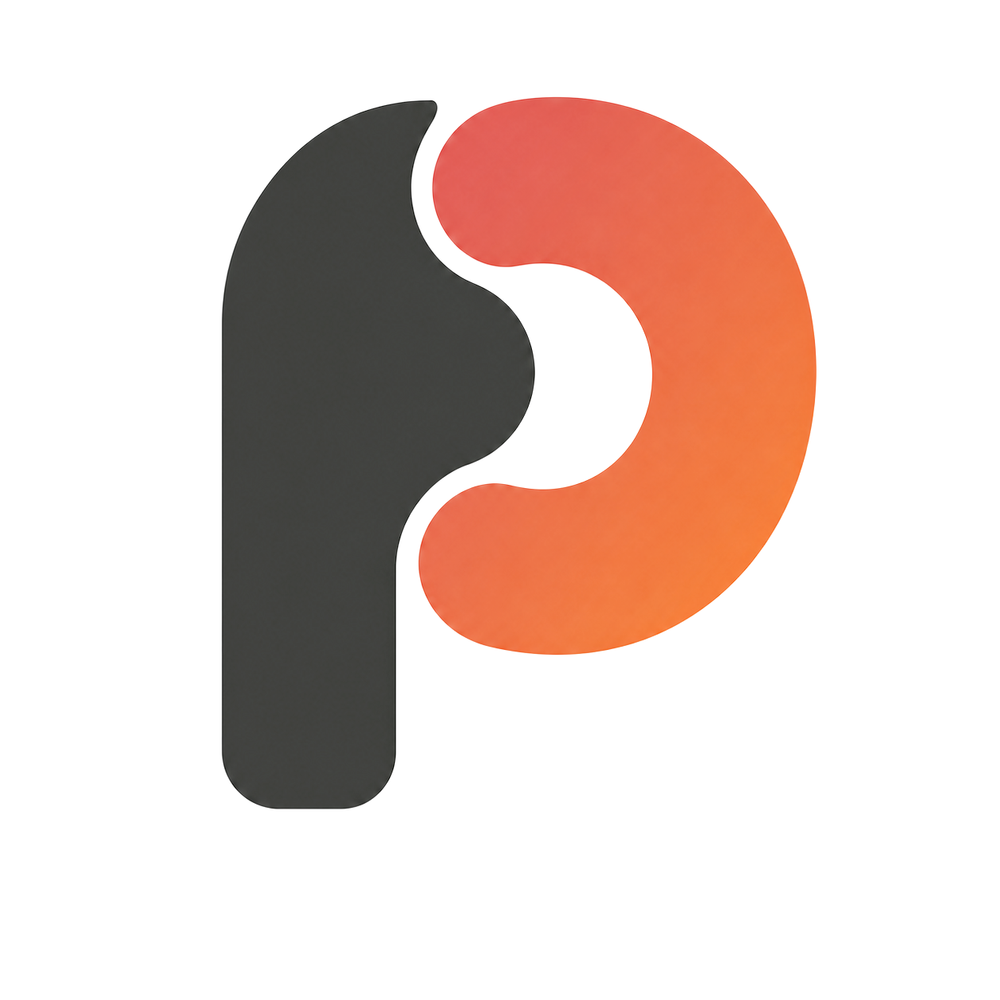

  

<h1 align="center">Pentect</h1>

AI can use your secrets without ever seeing them.

  <a href="https://pentect.dev/">Documentation</a> ·
  <a href="https://pentect.dev/start/install/">Install</a> ·
  <a href="https://pentect.dev/start/quick-start/">Quick start</a>

  
  
  

Pentect is a local security boundary between supported AI clients and their
providers. Start with the [documentation](https://pentect.dev/).

## Repository guides

- [Compatibility](COMPATIBILITY.md)
- [Plugins](PLUGINS.md)
- [Security](SECURITY.md)
- [Contributing](CONTRIBUTING.md)
- [Third-party notices](THIRD_PARTY_LICENSES.txt)

## License

[MIT](LICENSE)
